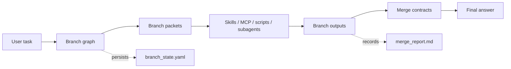
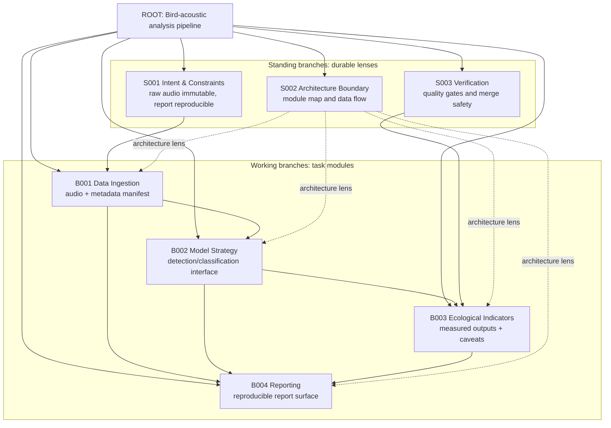
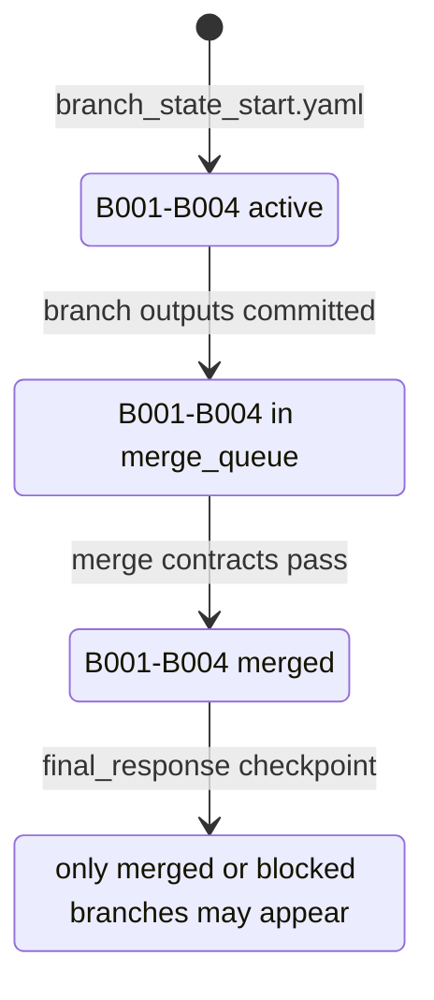

# BranchOS

[](#run-the-demo)
[](skills/branchos/scripts/validate_branch_state.py)
[](skills/branchos/SKILL.md)
[](docs/branchos_visual_report.md)
[](#design-boundaries)

**Architecture-first virtual task branching for agentic work.**

BranchOS gives an agent a disciplined way to think before it acts. Instead of rushing through a complex request as a linear checklist, the agent creates a virtual branch graph: standing branches for durable concerns, working branches for task modules, branch packets for scoped dispatch, and merge contracts for final synthesis.

It is not Git branching. It is task architecture.

```text
complex task -> virtual branch graph -> scoped tool/skill dispatch -> merge contracts -> final synthesis
```

## Why BranchOS Exists

Most agent work today is still too ephemeral. A model reads the prompt, reasons in the chat context, calls tools, and then the structure that guided the work fades away.

BranchOS follows the same deeper philosophy as the LLM Wiki pattern: useful agent work should compound into maintained artifacts, not be rediscovered from scratch every turn. LLM Wiki turns reading and synthesis into a persistent knowledge graph. BranchOS turns task execution into a persistent branch graph.

| Problem | LLM Wiki answer | BranchOS answer |
|---|---|---|
| Knowledge gets rediscovered each query | Maintain a persistent wiki | Maintain a persistent branch graph |
| Context is hard to audit | Write pages, indexes, logs | Write branch state, packets, merge reports |
| Synthesis can blur sources | Track source-to-page updates | Track branch-to-root merges |
| LLMs over-improvise | Schema disciplines wiki maintenance | Merge contracts discipline task execution |

## The Mental Model



BranchOS produces three practical artifacts:

- `branch_state.yaml`: the current virtual task map.
- `branch_packet.md`: the scoped work order before dispatching a tool, skill, or agent.
- `merge_report.md`: what was accepted, blocked, pruned, or carried forward.

## What The Agent Actually Does

Take this example task:

> Design a research-grade bird-acoustic analysis pipeline that ingests field recordings, detects bird vocalizations, computes ecological indicators, validates model quality, and produces a reproducible report.

A plain agent might start writing an architecture document immediately. BranchOS makes it stop and first throw a branch graph:



Then each branch gets a job, a dispatch route, and a merge condition:

| Branch | Why the agent creates it | Routed work | Output | Merge gate |
|---|---|---|---|---|
| `S001 Intent & Constraints` | Protect non-negotiables | Reasoning only | Locked constraints | No branch may override raw-audio immutability |
| `S002 Architecture Boundary` | Keep modules from blurring | Architecture skill / docs drafting | Module map and interfaces | Must name modules, data flow, validation hooks |
| `S003 Verification` | Stop untested claims from merging | Testing/review skill | Quality gates | Model and report outputs must be auditable |
| `B001 Data Ingestion` | Own raw recordings and metadata | Backend/data design | Manifest schema | Raw files stay read-only; metadata is traceable |
| `B002 Model Strategy` | Own model interface | Architecture/model reasoning | Versioned output contract | Confidence and uncertainty are preserved |
| `B003 Ecological Indicators` | Own ecological metrics | Domain/data skill | Indicator contract | Interpretation is separated from measured output |
| `B004 Reporting` | Own final report surface | Docs/report skill | Report outline | Claims reference artifacts and validation status |

## Branch Packet: A Scoped Work Order

Before the agent dispatches a specialized capability, BranchOS creates a packet. For the architecture branch, the packet says:

```text
Branch: S002 Architecture Boundary
Purpose: Design module boundaries and data flow.
Scope: ingestion, preprocessing, model, indicators, validation, reporting.
Non-goals: do not implement code; do not choose vendor cloud; do not change raw-data immutability.
Expected output: module proposal with interfaces and validation hooks.
Merge contract: only merge if modules, data flow, immutability, and validation hooks are explicit.
```

Full packet: [`examples/github_intro/branch_packet_architecture.md`](examples/github_intro/branch_packet_architecture.md)

## Lifecycle



BranchOS is useful because the final answer is not allowed to silently pull from unresolved branches. The demo includes a negative guard proving that `final_response` fails when working branches remain unresolved.

## Run The Demo

```bash
bash examples/github_intro/run_test.sh
```

Expected output:

```text
[1/5] task_start fixture: ok
[2/5] pre_dispatch fixture: ok
[3/5] pre_merge fixture: ok
[4/5] final_response fixture: ok
[5/5] unresolved final_response guard: ok
BranchOS GitHub intro test passed.
```

Manual checkpoints:

```bash
python3 skills/branchos/scripts/validate_branch_state.py examples/github_intro/branch_state_start.yaml --checkpoint task_start
python3 skills/branchos/scripts/validate_branch_state.py examples/github_intro/branch_state_start.yaml --checkpoint pre_dispatch
python3 skills/branchos/scripts/validate_branch_state.py examples/github_intro/branch_state_pre_merge.yaml --checkpoint pre_merge
python3 skills/branchos/scripts/validate_branch_state.py examples/github_intro/branch_state_final.yaml --checkpoint final_response
```

Complete walkthrough: [`docs/branchos_visual_report.md`](docs/branchos_visual_report.md)

## Repository Structure

```text
skills/branchos/
  SKILL.md                         # portable skill instructions
  references/                      # progressive-disclosure protocols
  templates/                       # branch map, branch packet, merge report
  scripts/validate_branch_state.py # stdlib validator

adapters/local/
  branchos_checkpoint.py           # local checkpoint adapter
  integration_adapter.md           # runtime placement notes

examples/github_intro/
  branch_state_start.yaml          # active branch graph
  branch_state_pre_merge.yaml      # ready_to_merge + merge_queue
  branch_state_final.yaml          # merged final state
  branch_packet_architecture.md    # example scoped dispatch packet
  merge_report.md                  # example synthesis report
  run_test.sh                      # runnable proof
```

## Checkpoints

| Checkpoint | What it protects |
|---|---|
| `task_start` | The task has a valid root and branch graph |
| `pre_dispatch` | Any real capability route has a branch packet |
| `pre_merge` | Branch outputs enter root only through a merge queue |
| `final_response` | Unresolved working branches cannot enter the final answer |

## Design Boundaries

- BranchOS is not Git branching.
- BranchOS is not a workflow runtime.
- BranchOS does not replace runtime boot, phase logging, postflight sync, or memory systems.
- BranchOS should not write global memory files directly.
- Branch count is chosen by the agent from task complexity, with standing branches separated from dynamic working branches.

## Tags

`agentic-workflow` `llm-agents` `task-planning` `virtual-branches` `skill-routing` `mcp-ready` `merge-contracts` `persistent-artifacts`
