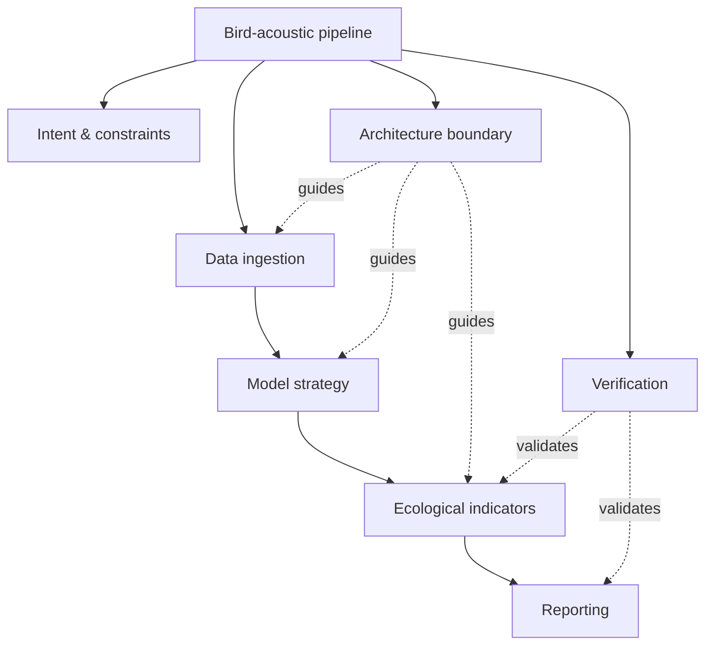

# Branch Builder

[English](README.md) | [Simplified Chinese](README.zh-CN.md)

[](#run-the-demo)
[](skills/branch-builder/scripts/validate_branch_state.py)
[](skills/branch-builder/SKILL.md)
[](docs/harness_integration.md)
[](#design-boundaries)

**Architecture-first virtual task branching for agentic work.**

Branch Builder helps an agent stop treating complex work as a flat checklist. It creates a virtual branch graph, routes tools and subagents through scoped branch packets, and merges outputs only after merge contracts pass.

It is packaged in skill format for portability, but it should be treated as a root-task planning layer, not as a repeatedly invoked tool skill. It can run standalone or as the shared planning layer inside [Fabric](https://github.com/Fly-Carrot/Fabric) and [Agent Shared Fabric](https://github.com/Fly-Carrot/agent-shared-fabric). It is not Git branching. It is task architecture.

```text
complex task -> virtual branch graph -> branch packets -> scoped dispatch -> merge contracts -> final synthesis
```

## Start-up Prompt

Paste this into your agent or project instructions:

```text
Use Branch Builder as the planning layer for medium or complex tasks.

Branch Builder is virtual task branching, not Git branching.
After normal harness boot and context loading, initialize or load `.agents/branch-builder/branch_state.yaml`.
Never create Branch Builder state with `touch` or `echo '{}'`; use the Branch Builder init script when state is missing or invalid.
Run one root task lifecycle only. Do not run boot, postflight, or the full lifecycle per virtual branch.
If the harness has a shared planning-layer root, check that before declaring Branch Builder unavailable.

Before specialist dispatch, create a branch packet.
Do not use init --force to fix pre_dispatch; prepare a working branch packet instead.
Before root synthesis, validate merge contracts.
Before final response, resolve working branches as merged, blocked, or pruned.
Final synthesis should use merged branch outputs only.
```

Local checkpoint adapter:

```bash
python3 skills/branch-builder/scripts/init_branch_state.py --objective "<current task objective>" --complexity medium
python3 adapters/local/branch_builder_checkpoint.py --checkpoint task_start --emit-summary
python3 skills/branch-builder/scripts/prepare_dispatch.py --name "<dispatch branch>" --scope "<bounded scope>" --expected-output "<expected result>" --capability scripts:"<tool>"
python3 adapters/local/branch_builder_checkpoint.py --checkpoint pre_dispatch --emit-summary
python3 skills/branch-builder/scripts/resolve_branch.py --branch-id B001 --status ready_to_merge --output "<branch result summary>"
python3 adapters/local/branch_builder_checkpoint.py --checkpoint pre_merge --emit-summary
python3 skills/branch-builder/scripts/resolve_branch.py --branch-id B001 --status merged --output "<merged branch result>"
python3 adapters/local/branch_builder_checkpoint.py --checkpoint final_response --emit-summary --emit-delta
```

## Shared Fabric Install

For Global Agent Fabric-style harnesses, install Branch Builder once into the shared planning-layer root:

```bash
python3 adapters/shared_fabric/install_branch_builder_shared_fabric.py \
  --global-root /path/to/global-agent-fabric \
  --update-global-rule \
  --export-antigravity
```

Then every workspace can use the shared scripts while keeping branch state local:

```bash
python3 /path/to/global-agent-fabric/skills/generated/branch-builder/scripts/init_branch_state.py \
  --workspace /path/to/workspace \
  --objective "<current task objective>" \
  --complexity medium
```

Use the shared `prepare_dispatch.py`, `resolve_branch.py`, and `branch_builder_checkpoint.py` for dispatch and closure. Full sequence: [`docs/harness_integration.md`](docs/harness_integration.md).

Workspace state stays in:

```text
<workspace>/.agents/branch-builder/branch_state.yaml
<workspace>/.agents/branch-builder/branch_events.ndjson
```

## Example

Task:

> Design a research-grade bird-acoustic analysis pipeline that ingests field recordings, detects bird vocalizations, computes ecological indicators, validates model quality, and produces a reproducible report.

Branch Builder turns it into:



Each branch has a purpose, allowed capabilities, expected output, and merge contract. Full visual walkthrough: [`docs/branch_builder_visual_report.md`](docs/branch_builder_visual_report.md)

## Run The Demo

```bash
bash examples/github_intro/run_test.sh
```

Expected output:

```text
[1/5] task_start fixture: ok
[2/5] pre_dispatch fixture: ok
[3/5] pre_merge fixture: ok
[4/5] final_response fixture: ok
[5/5] unresolved final_response guard: ok
Branch Builder GitHub intro test passed.
```

## What Is Included

```text
skills/branch-builder/                         # portable planning-layer package
skills/branch-builder/scripts/                 # validator + checkpoint adapter
adapters/local/                          # project-local adapter
adapters/shared_fabric/                  # shared fabric installer
examples/github_intro/                   # runnable proof
docs/                                    # integration and visual reports
```

## Docs

- [Harness integration](docs/harness_integration.md)
- [Visual branch report](docs/branch_builder_visual_report.md)
- [GitHub intro test](docs/github_intro_test.md)
- [Branch Builder planning-layer package](skills/branch-builder/SKILL.md)
- Chinese docs: [README.zh-CN.md](README.zh-CN.md)

## Design Boundaries

- Branch Builder is not Git branching.
- Branch Builder is not a workflow runtime.
- Branch Builder is not a traditional repeatedly-invoked skill.
- Branch Builder does not replace runtime boot, phase logging, postflight sync, or memory systems.
- Branch Builder keeps task state local and leaves durable memory write-back to the host harness.

## Tags

`agentic-workflow` `llm-agents` `task-planning` `virtual-branches` `skill-routing` `mcp-ready` `merge-contracts` `persistent-artifacts`
