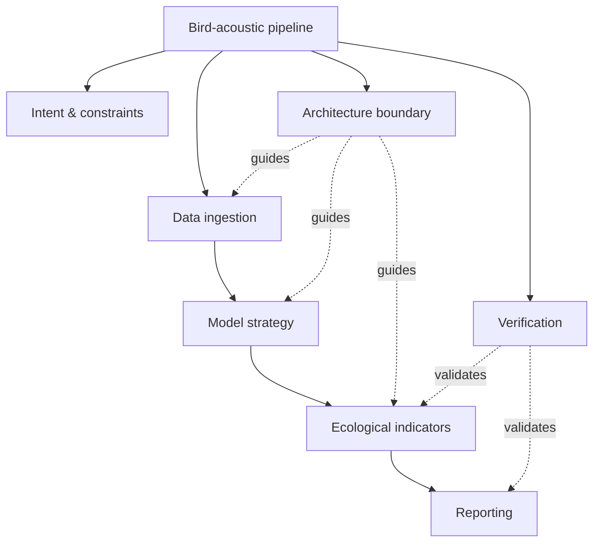

# BranchOS

[English](README.md) | [Simplified Chinese](README.zh-CN.md)

[](#run-the-demo)
[](skills/branchos/scripts/validate_branch_state.py)
[](skills/branchos/SKILL.md)
[](docs/harness_integration.md)
[](#design-boundaries)

**Architecture-first virtual task branching for agentic work.**

BranchOS helps an agent stop treating complex work as a flat checklist. It creates a virtual branch graph, routes tools and subagents through scoped branch packets, and merges outputs only after merge contracts pass.

It is not Git branching. It is task architecture.

```text
complex task -> virtual branch graph -> branch packets -> scoped dispatch -> merge contracts -> final synthesis
```

## Start-up Prompt

Paste this into your agent or project instructions:

```text
Use BranchOS as the planning layer for medium or complex tasks.

BranchOS is virtual task branching, not Git branching.
After normal harness boot and context loading, create or load `.agents/branchos/branch_state.yaml`.
Run one root task lifecycle only. Do not run boot, postflight, or the full lifecycle per virtual branch.
If the harness has a shared skill root, check that before declaring BranchOS unavailable.

Before specialist dispatch, create a branch packet.
Before root synthesis, validate merge contracts.
Final synthesis should use merged branch outputs only.
```

Local checkpoint adapter:

```bash
python3 adapters/local/branchos_checkpoint.py --checkpoint task_start --emit-summary
python3 adapters/local/branchos_checkpoint.py --checkpoint pre_dispatch --emit-summary
python3 adapters/local/branchos_checkpoint.py --checkpoint pre_merge --emit-summary
python3 adapters/local/branchos_checkpoint.py --checkpoint final_response --emit-summary --emit-delta
```

## Shared Fabric Install

For Global Agent Fabric-style harnesses, install BranchOS once into the shared skill root:

```bash
python3 adapters/shared_fabric/install_branchos_shared_fabric.py \
  --global-root /path/to/global-agent-fabric \
  --update-global-rule \
  --export-antigravity
```

Then every workspace can use the shared checkpoint script while keeping branch state local:

```bash
python3 /path/to/global-agent-fabric/skills/generated/branchos/scripts/branchos_checkpoint.py \
  --workspace /path/to/workspace \
  --checkpoint task_start \
  --emit-summary
```

Workspace state stays in:

```text
<workspace>/.agents/branchos/branch_state.yaml
<workspace>/.agents/branchos/branch_events.ndjson
```

## Example

Task:

> Design a research-grade bird-acoustic analysis pipeline that ingests field recordings, detects bird vocalizations, computes ecological indicators, validates model quality, and produces a reproducible report.

BranchOS turns it into:



Each branch has a purpose, allowed capabilities, expected output, and merge contract. Full visual walkthrough: [`docs/branchos_visual_report.md`](docs/branchos_visual_report.md)

## Run The Demo

```bash
bash examples/github_intro/run_test.sh
```

Expected output:

```text
[1/5] task_start fixture: ok
[2/5] pre_dispatch fixture: ok
[3/5] pre_merge fixture: ok
[4/5] final_response fixture: ok
[5/5] unresolved final_response guard: ok
BranchOS GitHub intro test passed.
```

## What Is Included

```text
skills/branchos/                         # portable skill
skills/branchos/scripts/                 # validator + checkpoint adapter
adapters/local/                          # project-local adapter
adapters/shared_fabric/                  # shared fabric installer
examples/github_intro/                   # runnable proof
docs/                                    # integration and visual reports
```

## Docs

- [Harness integration](docs/harness_integration.md)
- [Visual branch report](docs/branchos_visual_report.md)
- [GitHub intro test](docs/github_intro_test.md)
- [BranchOS skill](skills/branchos/SKILL.md)
- Chinese docs: [README.zh-CN.md](README.zh-CN.md)

## Design Boundaries

- BranchOS is not Git branching.
- BranchOS is not a workflow runtime.
- BranchOS does not replace runtime boot, phase logging, postflight sync, or memory systems.
- BranchOS keeps task state local and leaves durable memory write-back to the host harness.

## Companion Projects

- [Fabric](https://github.com/Fly-Carrot/Fabric)
- [Agent Shared Fabric](https://github.com/Fly-Carrot/agent-shared-fabric)
- [Gemini-2 CLI](https://github.com/Fly-Carrot/gemini-cli)
- [Gemini CLI Optimization](https://github.com/Fly-Carrot/Gemini_CLI_Optimization)
- [NotebookLM to Obsidian](https://github.com/Fly-Carrot/NotebookLM-to-Obisidian)

## Tags

`agentic-workflow` `llm-agents` `task-planning` `virtual-branches` `skill-routing` `mcp-ready` `merge-contracts` `persistent-artifacts`
