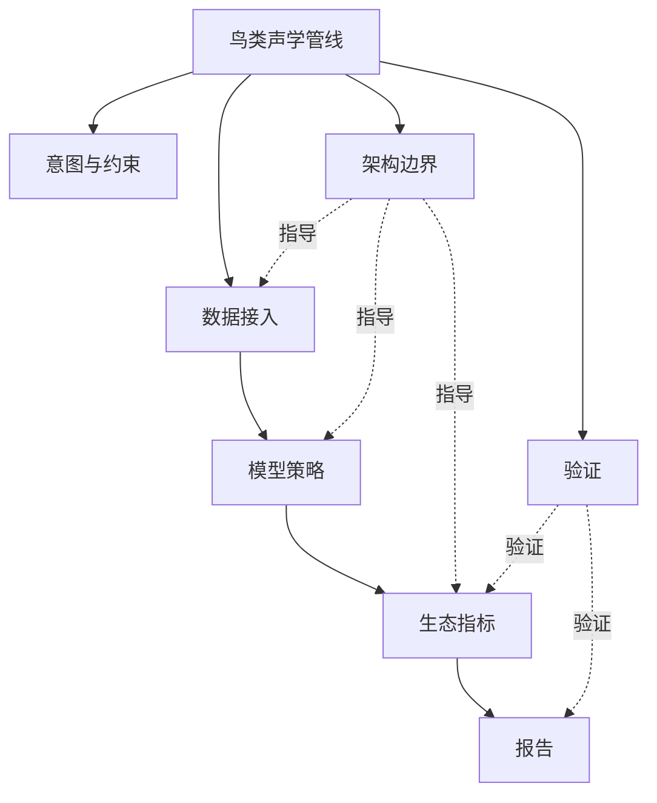

# Branch Builder

[English](README.md) | [简体中文](README.zh-CN.md)

[](#运行-demo)
[](skills/branch-builder/scripts/validate_branch_state.py)
[](skills/branch-builder/SKILL.md)
[](docs/harness_integration.zh-CN.md)
[](#设计边界)

**面向 agent 工作的架构优先虚拟任务分支系统。**

Branch Builder 帮助 agent 不再把复杂任务当成一条扁平 checklist。它先建立虚拟分支图，再通过有边界的 branch packet 路由工具和子代理，最后只把通过 merge contract 的分支结果合成到最终答案。

它用 skill format 打包，方便不同 harness 加载，但运行语义不是可反复调用的普通工具 skill，而是每个 root task 最多激活一次的规划层。它既可以独立使用，也可以作为 [Fabric](https://github.com/Fly-Carrot/Fabric) 和 [Agent Shared Fabric](https://github.com/Fly-Carrot/agent-shared-fabric) 中的共享规划层使用。它不是 Git 分支。它是任务架构。

```text
复杂任务 -> 虚拟分支图 -> branch packet -> 有边界的能力分发 -> merge contract -> 最终合成
```

## 启动 Prompt

把下面内容放进你的 agent 或项目指令中：

```text
Use Branch Builder as the planning layer for medium or complex tasks.

Branch Builder is virtual task branching, not Git branching.
After normal harness boot and context loading, initialize or load `.agents/branch-builder/branch_state.yaml`.
Never create Branch Builder state with `touch` or `echo '{}'`; use the Branch Builder init script when state is missing or invalid.
Run one root task lifecycle only. Do not run boot, postflight, or the full lifecycle per virtual branch.
If the harness has a shared planning-layer root, check that before declaring Branch Builder unavailable.

Before specialist dispatch, create a branch packet.
Do not use init --force to fix pre_dispatch; prepare a working branch packet instead.
Before root synthesis, validate merge contracts.
Before final response, resolve working branches as merged, blocked, or pruned.
Final synthesis should use merged branch outputs only.

Report `[BRANCH_BUILDER_ACTIVE]` only after `task_start` returns that `status_marker`.
Report `[BRANCH_BUILDER_REPORT]` only after `final_response` returns that `status_marker`.
Report `[BRANCH_BUILDER_OPEN]` when unresolved working branches remain.
```

本地 checkpoint adapter：

```bash
python3 skills/branch-builder/scripts/init_branch_state.py --objective "<current task objective>" --complexity medium
python3 adapters/local/branch_builder_checkpoint.py --checkpoint task_start --emit-summary
python3 skills/branch-builder/scripts/prepare_dispatch.py --name "<dispatch branch>" --scope "<bounded scope>" --expected-output "<expected result>" --capability scripts:"<tool>"
python3 adapters/local/branch_builder_checkpoint.py --checkpoint pre_dispatch --emit-summary
python3 skills/branch-builder/scripts/resolve_branch.py --branch-id B001 --status ready_to_merge --output "<branch result summary>"
python3 adapters/local/branch_builder_checkpoint.py --checkpoint pre_merge --emit-summary
python3 skills/branch-builder/scripts/resolve_branch.py --branch-id B001 --status merged --output "<merged branch result>"
python3 adapters/local/branch_builder_checkpoint.py --checkpoint final_response --emit-summary --emit-delta
```

## Shared Fabric 安装

对于 Global Agent Fabric 类型的 harness，把 Branch Builder 一次性安装到共享规划层 root：

```bash
python3 adapters/shared_fabric/install_branch_builder_shared_fabric.py \
  --global-root /path/to/global-agent-fabric \
  --update-global-rule \
  --export-antigravity
```

之后每个 workspace 都可以使用共享脚本，同时把分支状态保留在本地：

```bash
python3 /path/to/global-agent-fabric/skills/generated/branch-builder/scripts/init_branch_state.py \
  --workspace /path/to/workspace \
  --objective "<current task objective>" \
  --complexity medium
```

使用共享的 `prepare_dispatch.py`、`resolve_branch.py` 和 `branch_builder_checkpoint.py` 完成分发与闭环。完整流程见 [`docs/harness_integration.zh-CN.md`](docs/harness_integration.zh-CN.md)。

workspace 状态保存在：

```text
<workspace>/.agents/branch-builder/branch_state.yaml
<workspace>/.agents/branch-builder/branch_events.ndjson
```

## 示例

任务：

> 设计一个研究级鸟类声学分析管线：输入野外录音，检测鸟类鸣声，计算生态指标，验证模型质量，并生成可复现报告。

Branch Builder 会把它变成：



每个分支都有自己的目的、允许调用的能力、预期输出和合并条件。完整可视化说明见 [`docs/branch_builder_visual_report.zh-CN.md`](docs/branch_builder_visual_report.zh-CN.md)。

## 运行 Demo

```bash
bash examples/github_intro/run_test.sh
```

预期输出：

```text
[1/5] task_start fixture: ok [BRANCH_BUILDER_ACTIVE]
[2/5] pre_dispatch fixture: ok [BRANCH_BUILDER_CHECKPOINT_OK]
[3/5] pre_merge fixture: ok [BRANCH_BUILDER_CHECKPOINT_OK]
[4/5] final_response fixture: ok [BRANCH_BUILDER_REPORT]
[5/5] unresolved final_response guard: ok [BRANCH_BUILDER_OPEN]
Branch Builder GitHub intro test passed.
```

## 包含内容

```text
skills/branch-builder/                         # 可移植规划层包
skills/branch-builder/scripts/                 # validator 与 checkpoint adapter
adapters/local/                          # 项目本地 adapter
adapters/shared_fabric/                  # shared fabric 安装器
examples/github_intro/                   # 可运行证明
docs/                                    # 集成文档与可视化报告
```

## 文档

- [Harness 集成](docs/harness_integration.zh-CN.md)
- [可视化分支报告](docs/branch_builder_visual_report.zh-CN.md)
- [GitHub intro 测试](docs/github_intro_test.zh-CN.md)
- [Branch Builder 规划层包](skills/branch-builder/SKILL.zh-CN.md)
- 英文文档：[README.md](README.md)

## 设计边界

- Branch Builder 不是 Git 分支。
- Branch Builder 不是 workflow runtime。
- Branch Builder 不是可反复调用的传统 skill。
- Branch Builder 不替代 runtime boot、phase logging、postflight sync 或 memory system。
- Branch Builder 只维护任务本地状态，长期记忆写回由宿主 harness 负责。

## 标签

`agentic-workflow` `llm-agents` `task-planning` `virtual-branches` `skill-routing` `mcp-ready` `merge-contracts` `persistent-artifacts`
