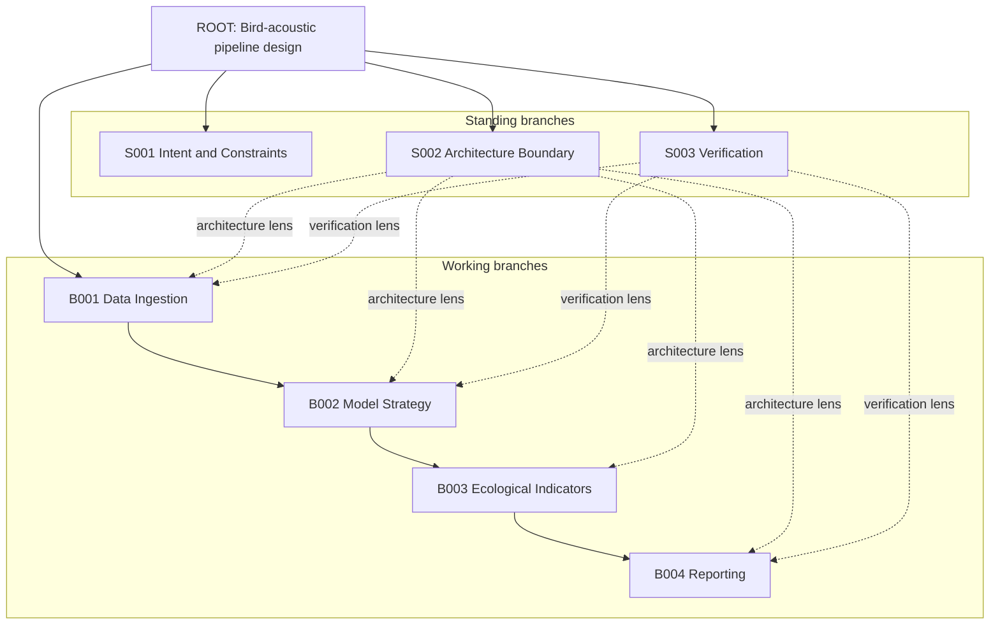
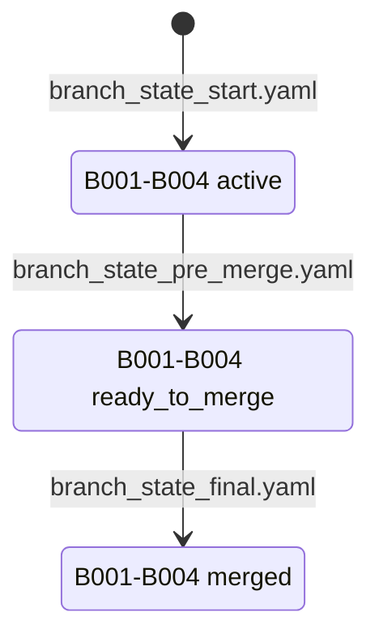
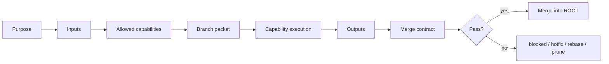

# Branch Builder Visual Report

[English](branch_builder_visual_report.md) | [Simplified Chinese](branch_builder_visual_report.zh-CN.md)

This report explains the `examples/github_intro` demo: what the example is, what the branch graph looks like, how each branch operates, and what the test validates.

## 1. Demo Task

The demo task is:

> Design a research-grade bird-acoustic analysis pipeline that ingests field recordings, detects bird vocalizations, computes ecological indicators, validates model quality, and produces a reproducible report.

This task is useful as a demo because it is not a simple Q&A request. It naturally contains data intake, modeling, ecological interpretation, validation, and reporting.

## 2. Branch Graph

This is not a Git branch graph. It is a virtual task-branch graph.

- `standing branches`: persistent lenses for constraints, architecture, and verification.
- `working branches`: dynamic task branches for the current work modules.



## 3. State Flow

The example uses three state snapshots:

- `branch_state_start.yaml`: working branches are `active`.
- `branch_state_pre_merge.yaml`: working branches are `ready_to_merge` and listed in `merge_queue`.
- `branch_state_final.yaml`: working branches are `merged`, so final synthesis is allowed.



## 4. Branch Roles

| Branch | Type | Role | Merge Condition |
|---|---|---|---|
| `S001 Intent and Constraints` | standing | Protect user intent and locked constraints | Working branches cannot override locked constraints |
| `S002 Architecture Boundary` | standing | Define module boundaries and data flow | Major modules, interfaces, and data flow are explicit |
| `S003 Verification` | standing | Protect quality gates and merge safety | Outputs are testable, auditable, or traceable |
| `B001 Data Ingestion` | working | Design raw-audio and metadata intake | Raw files remain read-only; metadata is traceable |
| `B002 Model Strategy` | working | Design detection/classification interface | Model output is versioned and uncertainty is preserved |
| `B003 Ecological Indicators` | working | Define ecological indicators | Measured outputs and interpretation are separated |
| `B004 Reporting` | working | Design reproducible report surface | Report can be rebuilt from artifacts and config |

## 5. Branch Execution Protocol

Each dispatchable branch is a structured work cell:



The demo branch packet is:

`examples/github_intro/branch_packet_architecture.md`

The demo merge report is:

`examples/github_intro/merge_report.md`

## 6. Checkpoint Test

Run:

```bash
bash examples/github_intro/run_test.sh
```

Expected output:

```text
[1/5] task_start fixture: ok [BRANCH_BUILDER_ACTIVE]
[2/5] pre_dispatch fixture: ok [BRANCH_BUILDER_CHECKPOINT_OK]
[3/5] pre_merge fixture: ok [BRANCH_BUILDER_CHECKPOINT_OK]
[4/5] final_response fixture: ok [BRANCH_BUILDER_REPORT]
[5/5] unresolved final_response guard: ok [BRANCH_BUILDER_OPEN]
Branch Builder GitHub intro test passed.
```

What the checkpoints prove:

| Checkpoint | Validation |
|---|---|
| `task_start` | The root task and branch graph are valid |
| `pre_dispatch` | Dispatchable branches have branch packets |
| `pre_merge` | Merge requires an explicit merge queue |
| `final_response` | Unresolved working branches cannot enter the final answer |
| negative guard | The final checkpoint fails when run on unresolved start state |

## 7. Why The Demo Matters

The demo shows that Branch Builder can:

1. Turn a complex task into standing and working branches.
2. Route specialist work through branch packets.
3. Merge branch outputs only through explicit contracts.
4. Prevent unresolved working branches from silently entering the final response.
