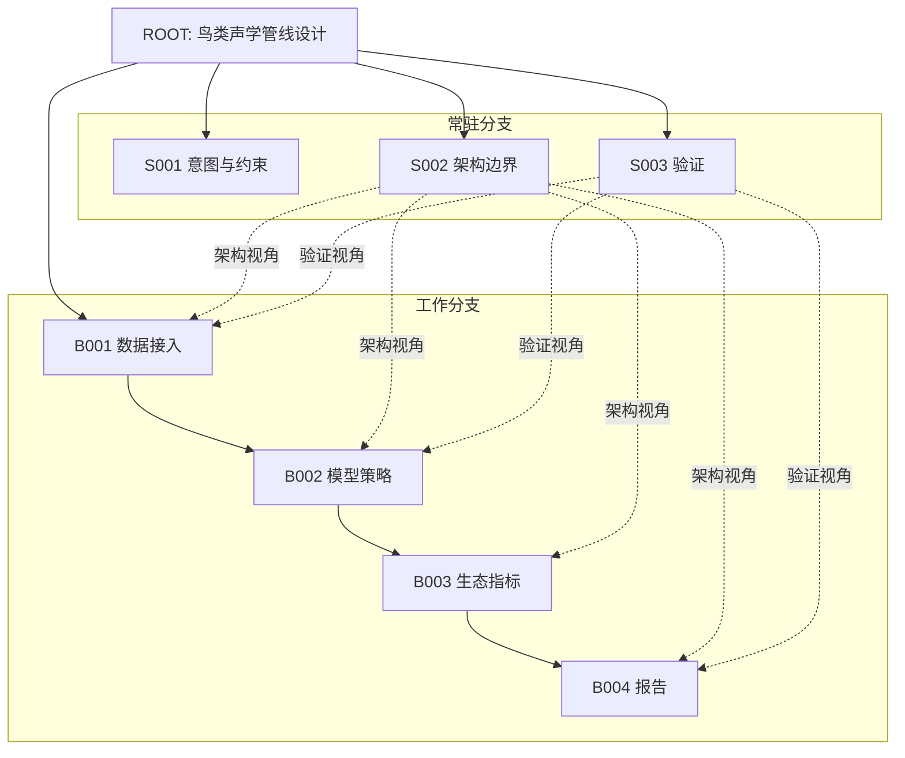
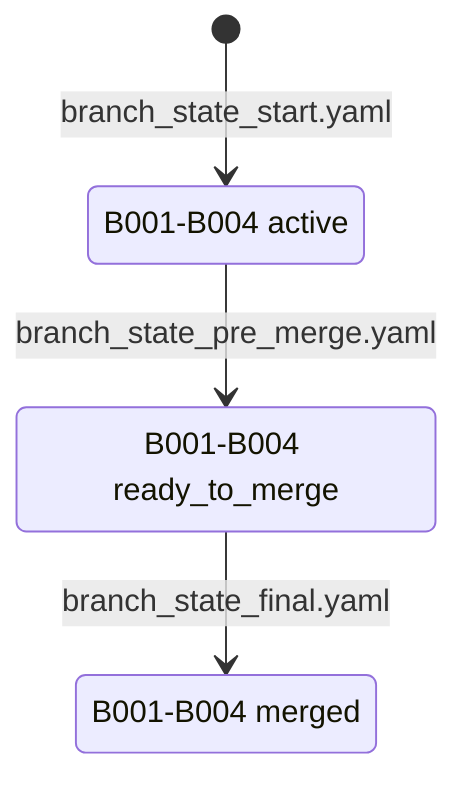
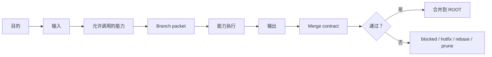

# Branch Builder 可视化报告

[English](branch_builder_visual_report.md) | [简体中文](branch_builder_visual_report.zh-CN.md)

本报告解释 `examples/github_intro` 示例：这个实例是什么、分支图长什么样、每个分支如何运作，以及测试实际验证了什么。

## 1. Demo 任务

示例任务是：

> 设计一个研究级鸟类声学分析管线：输入野外录音，检测鸟类鸣声，计算生态指标，验证模型质量，并生成可复现报告。

这个任务适合作为 demo，因为它不是简单问答，而是天然包含数据接入、模型策略、生态解释、质量验证和报告输出。

## 2. 分支图

这不是 Git 分支图，而是虚拟任务分支图。

- `standing branches`：常驻分支，用来保护约束、架构边界和验证视角。
- `working branches`：工作分支，用来处理当前任务中的具体模块。



## 3. 状态流

示例使用三个状态快照：

- `branch_state_start.yaml`：工作分支处于 `active`。
- `branch_state_pre_merge.yaml`：工作分支变成 `ready_to_merge`，并进入 `merge_queue`。
- `branch_state_final.yaml`：工作分支已经 `merged`，允许生成最终合成。



## 4. 分支角色

| 分支 | 类型 | 作用 | 合并条件 |
|---|---|---|---|
| `S001 Intent and Constraints` | 常驻 | 保护用户意图和锁定约束 | 工作分支不能覆盖锁定约束 |
| `S002 Architecture Boundary` | 常驻 | 定义模块边界和数据流 | 主要模块、接口和数据流必须明确 |
| `S003 Verification` | 常驻 | 保护质量门和合并安全 | 输出必须可测试、可审计或可追溯 |
| `B001 Data Ingestion` | 工作 | 设计原始录音和元数据入口 | 原始文件只读，元数据可追溯 |
| `B002 Model Strategy` | 工作 | 设计检测/分类模型接口 | 模型输出有版本，保留不确定性 |
| `B003 Ecological Indicators` | 工作 | 定义生态指标 | 测量输出和生态解释必须分离 |
| `B004 Reporting` | 工作 | 设计可复现报告界面 | 报告可由 artifacts 和 config 重建 |

## 5. 分支执行协议

每个可分发的分支都是一个结构化工作舱：



示例 branch packet：

`examples/github_intro/branch_packet_architecture.md`

示例 merge report：

`examples/github_intro/merge_report.md`

## 6. Checkpoint 测试

运行：

```bash
bash examples/github_intro/run_test.sh
```

预期输出：

```text
[1/5] task_start fixture: ok [BRANCH_BUILDER_ACTIVE]
[2/5] pre_dispatch fixture: ok [BRANCH_BUILDER_CHECKPOINT_OK]
[3/5] pre_merge fixture: ok [BRANCH_BUILDER_CHECKPOINT_OK]
[4/5] final_response fixture: ok [BRANCH_BUILDER_REPORT]
[5/5] unresolved final_response guard: ok [BRANCH_BUILDER_OPEN]
Branch Builder GitHub intro test passed.
```

各 checkpoint 验证内容：

| Checkpoint | 验证内容 |
|---|---|
| `task_start` | 根任务和分支图结构合法 |
| `pre_dispatch` | 可分发分支必须有 branch packet |
| `pre_merge` | 合并前必须存在明确的 merge queue |
| `final_response` | 未解决的工作分支不能进入最终答案 |
| negative guard | 用未解决的起始状态运行最终 checkpoint 必须失败 |

## 7. 为什么这个 demo 重要

这个 demo 说明 Branch Builder 可以：

1. 把复杂任务转化为常驻分支和工作分支。
2. 通过 branch packet 约束专业能力调用。
3. 只通过明确的 merge contract 合并分支输出。
4. 阻止未解决的工作分支悄悄进入最终答案。
