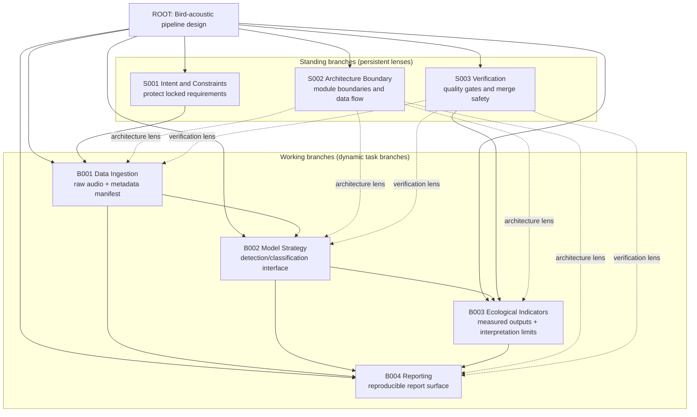
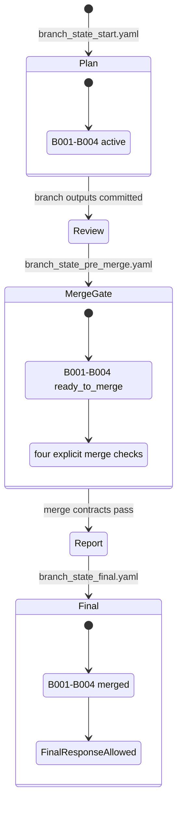
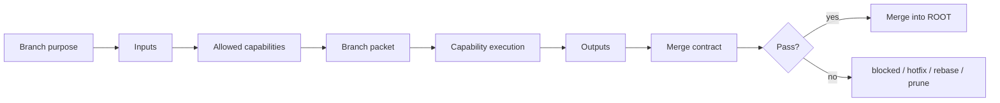
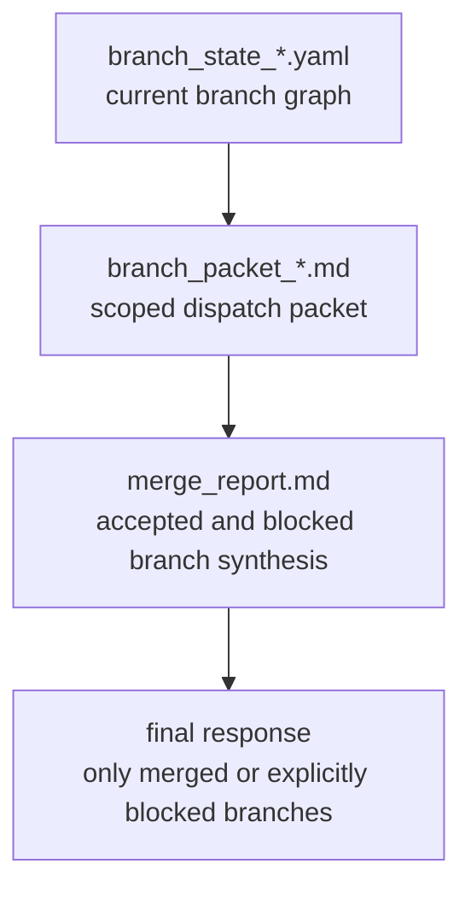

# BranchOS 实例记录与可视化报告

本报告解释 `examples/github_intro` 里的 BranchOS 示例到底是什么、图结构如何、每个分支如何运作，以及测试实际验证了什么。

## 1. 实例任务

示例任务是：

> Design a research-grade bird-acoustic analysis pipeline that ingests field recordings, detects bird vocalizations, computes ecological indicators, validates model quality, and produces a reproducible report.

中文解释：设计一个研究级鸟类声学分析管线，输入野外录音，完成鸟声检测、生态指标计算、质量验证，并输出可复现报告。

这个任务被选作 demo，是因为它不是简单问答，而是天然包含数据、模型、生态解释、验证、报告五类工作，非常适合展示 BranchOS 的“虚拟任务分支图”。

## 2. BranchOS 的实例图

这个实例不是 Git 分支图，而是任务认知分支图。它分成两层：

- `standing branches`：常驻分支，负责长期约束、架构边界和验证视角。
- `working branches`：工作分支，负责当前任务的具体功能板块。



## 3. 状态流：从规划到最终输出

实例中有三个状态快照：

- `branch_state_start.yaml`：任务刚开始，工作分支都是 `active`。
- `branch_state_pre_merge.yaml`：各分支已有输出，变成 `ready_to_merge`，进入 `merge_queue`。
- `branch_state_final.yaml`：工作分支全部 `merged`，最终输出允许生成。



## 4. 每个分支如何运作

| Branch | 类型 | 作用 | 输入 | 输出 | 合并条件 |
|---|---|---|---|---|---|
| `S001 Intent and Constraints` | standing | 保护用户目标和锁定约束 | 根任务、用户要求 | 约束清单 | 工作分支不能覆盖锁定约束 |
| `S002 Architecture Boundary` | standing | 定义模块边界和数据流 | 根任务、约束、工作分支需求 | 模块图、接口边界 | 必须命名主要模块、说明数据流、保留 raw-data immutability |
| `S003 Verification` | standing | 负责质量门、验证和合并安全 | 工作分支输出 | validation criteria | 每个输出都能被测试、审计或追溯 |
| `B001 Data Ingestion` | working | 设计原始录音和元数据入口 | raw recordings、field metadata | manifest schema | raw files 只读，metadata 可追溯 |
| `B002 Model Strategy` | working | 设计检测/分类模型接口 | audio chunks、model version metadata | model output contract | 模型输出必须 versioned，保留 confidence/uncertainty |
| `B003 Ecological Indicators` | working | 定义生态指标和解释边界 | model detections、site metadata、time windows | indicator contract | measured output 和 ecological interpretation 分离 |
| `B004 Reporting` | working | 设计可复现报告输出 | manifest、model outputs、indicator summaries | report outline | 报告可从 artifacts/config 重建，不能隐藏 uncertainty |

## 5. 分支内部的执行协议

每个可调度分支并不是一句标题，而是一个结构化工作舱：



在实例中，`S002 Architecture Boundary` 的 branch packet 是：

```text
Purpose: Design module boundaries and data flow.
Scope: Define ingestion, preprocessing, detection/classification, ecological indicator, validation, and reporting modules.
Non-goals: Do not choose a vendor cloud stack; do not implement code; do not change raw-recording immutability.
Expected output: Architecture proposal with modules, data flow, interfaces, unresolved decisions.
Merge contract: must name modules, explain data flow, preserve raw-data immutability, identify validation hooks.
```

对应文件：

`examples/github_intro/branch_packet_architecture.md`

## 6. 实际输出长什么样

BranchOS 的输出不是单一答案，而是一组可审计中间产物。



实例最终 merge report 接受了：

- `B001 Data Ingestion`：不可变 raw-audio intake、metadata normalization、manifest generation。
- `B002 Model Strategy`：可插拔 detection/classification layer、model-version tracking。
- `B003 Ecological Indicators`：occupancy、activity rhythm、acoustic diversity、uncertainty-aware summaries。
- `B004 Reporting`：可复现报告层，分离 measured outputs 与 interpretation。

对应文件：

`examples/github_intro/merge_report.md`

## 7. Checkpoint 测试记录

一键测试命令：

```bash
bash examples/github_intro/run_test.sh
```

真实输出：

```text
[1/5] task_start fixture: ok
[2/5] pre_dispatch fixture: ok
[3/5] pre_merge fixture: ok
[4/5] final_response fixture: ok
[5/5] unresolved final_response guard: ok
BranchOS GitHub intro test passed.
```

每一步验证的含义：

| Step | Checkpoint | 验证内容 |
|---|---|---|
| 1 | `task_start` | 起始状态至少有 standing/working branches，根任务结构合法 |
| 2 | `pre_dispatch` | active/reviewing 且有真实能力路线的分支必须带 branch packet |
| 3 | `pre_merge` | 准备合并时必须存在 merge queue |
| 4 | `final_response` | final 状态不能存在 unresolved working branches |
| 5 | negative guard | 用 start 状态直接跑 final_response 必须失败，证明未合并分支不能偷渡进最终答案 |

## 8. 为什么这个实例能说明 BranchOS 的价值

这个示例展示了 BranchOS 的四个核心能力：

1. **结构化理解任务**：不是线性 checklist，而是拆成常驻约束分支和动态工作分支。
2. **约束能力调用**：任何真正进入 dispatch 的分支，都需要 branch packet。
3. **约束合并**：工作分支不能随便污染最终答案，必须经过 merge contract。
4. **保护最终输出**：只要 working branch 仍 unresolved，`final_response` checkpoint 就会失败。

## 9. 公开展示时的推荐说法

BranchOS can be introduced as:

> BranchOS is a portable skill for architecture-first agent planning. It turns complex tasks into virtual branch graphs, routes tools and agents through branch packets, validates merge contracts, and prevents unresolved branches from silently entering the final answer.

中文版本：

> BranchOS 是一个面向复杂 agent 任务的架构优先规划 skill。它把任务转化为虚拟分支图，通过 branch packet 约束工具与子代理调用，通过 merge contract 控制分支合并，并阻止未解决分支悄悄进入最终答案。
